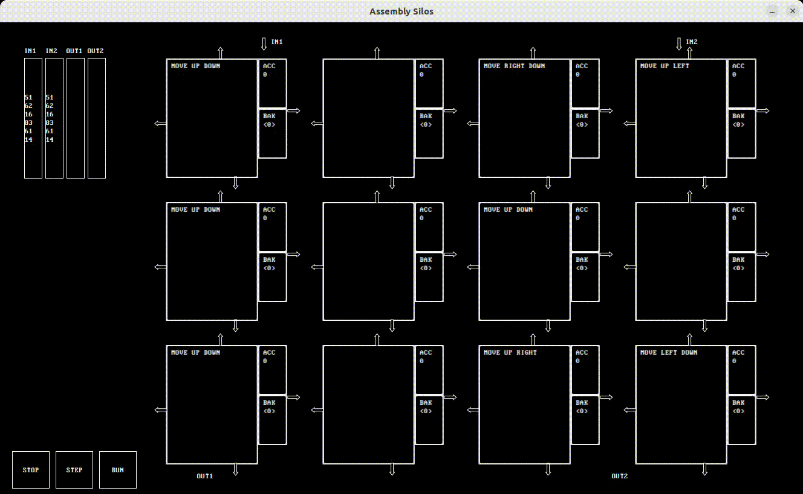
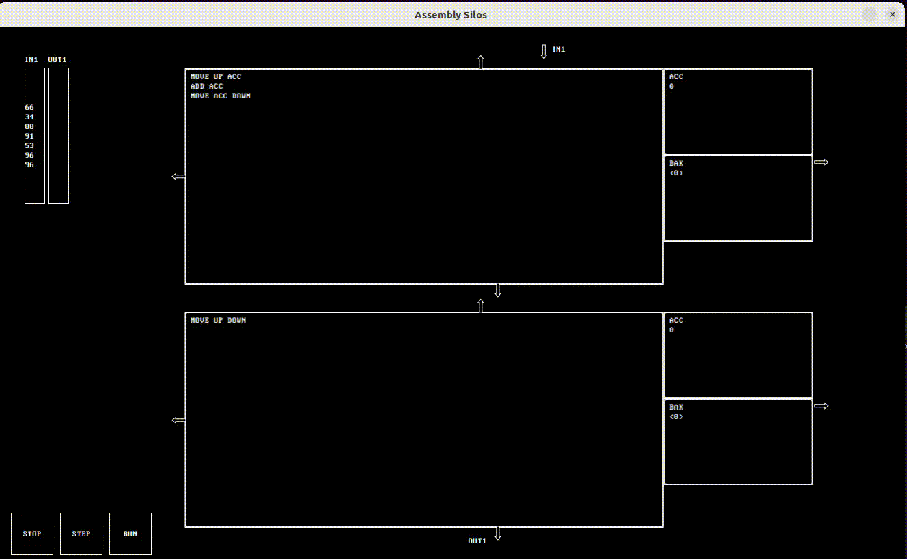
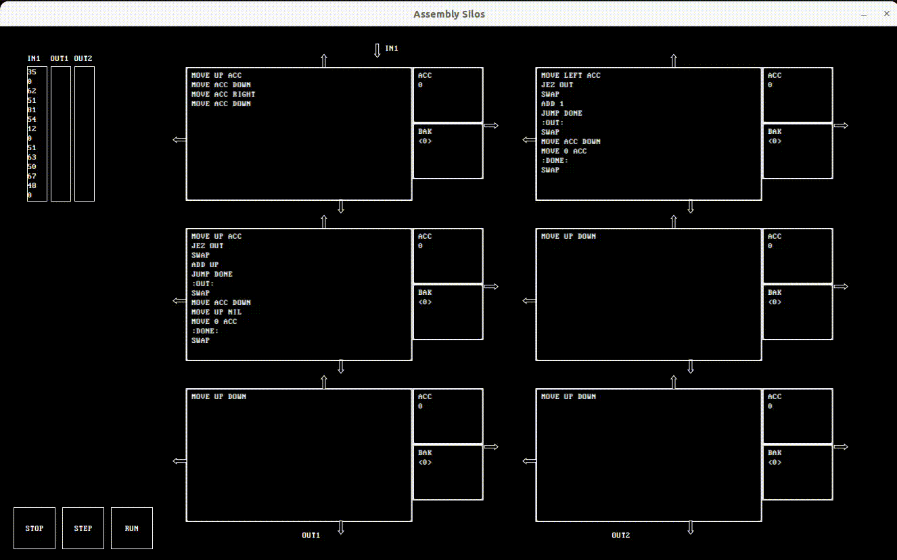

# CS 351 Project 4 Assembly Silos

Stable build jar: `./jars/tisnt100_v1.1.3.jar`

## Running
`java  --module-path /WhereeverYouPutIt/javafx-sdk-20/lib --add-modules javafx.controls,javafx.fxml -jar ./jars/tisnt100_v1.1.3.jar < ./res/input1-1.txt`

### input1-1

### input2

### input3

## Authors and acknowledgment
Logan Sullivan  
Carter Frost  
Emely Seheon  

Thanks to Zach Barth creator of TIS-100 and inspiration for the assignment. 